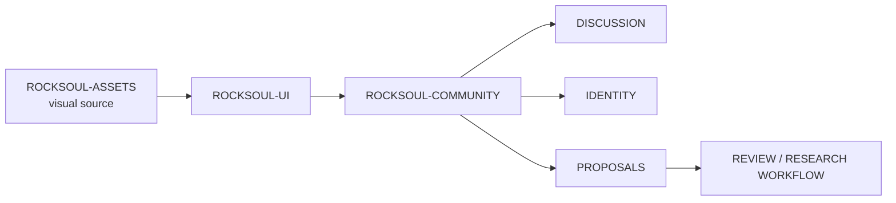

<div align="center">


# ROCKSOUL COMMUNITY

## **THE PARTICIPATION LAYER**

### **DISCUSS THE RECORD. KEEP THE SOURCE VISIBLE.**

Community and identity surface for the **MoonWitness × Rocksoul** ecosystem: participation, discussion, profiles, authentication, shared cases, and source-aware collaboration.


[Design Source](https://github.com/bjo163/rocksoul-assets) · [UI System](https://github.com/bjo163/rocksoul-ui) · [Public Web](https://github.com/bjo163/rocksoul-web) · [Platform](https://github.com/bjo163/rocksoul-platform)

</div>

---

> **COMMUNITY can discuss, annotate, propose, and collaborate. It does not silently convert participation into canonical research truth.**

## Product role



The canonical visual references are `rocksoul-assets` screens **13–14** for **Community + Authentication**.

## Community surfaces

```text
COMMUNITY HOME
THREADS / DISCUSSION
CASE CONVERSATION
PROFILE
AUTHENTICATION
NOTIFICATIONS
SOURCE-AWARE PROPOSALS
MODERATION STATES
```

## Boundary contract

```text
USER CONTRIBUTION
      ↓
DISCUSSION / PROPOSAL
      ↓
REVIEW
      ↓
OWNING DOMAIN WORKFLOW
      ↓
CANONICALIZATION — only if accepted there
```

Community content must preserve attribution, source links, edit history, moderation state, and uncertainty where relevant.

## Ecosystem map

| Layer | Repository | Responsibility |
|---|---|---|
| DESIGN | [`rocksoul-assets`](https://github.com/bjo163/rocksoul-assets) | canonical visual language |
| UI | [`rocksoul-ui`](https://github.com/bjo163/rocksoul-ui) | reusable components and application grammar |
| WEB | [`rocksoul-web`](https://github.com/bjo163/rocksoul-web) | public observatory |
| COMMUNITY | **`rocksoul-community`** | participation, identity, collaboration |
| PLATFORM | [`rocksoul-platform`](https://github.com/bjo163/rocksoul-platform) | administration, permissions, moderation operations |
| CONSOLE | [`rocksoul-crayon`](https://github.com/bjo163/rocksoul-crayon) | research/operator workflow |

## Visual contract

- expressive community surface, but readable evidence/status first;
- use canonical MoonWitness brand and Rocksoul lockup;
- consume `@rocksoul/ui` instead of recreating primitives;
- authorization and system states must follow `rocksoul-assets`;
- never reduce trust, moderation, or evidence to color alone;
- discussion ≠ evidence; popularity ≠ validity; proposal ≠ canonical record.

---

<div align="center">


## **PARTICIPATE WITHOUT LOSING PROVENANCE.**

`COMMUNITY / MoonWitness × Rocksoul`

</div>
